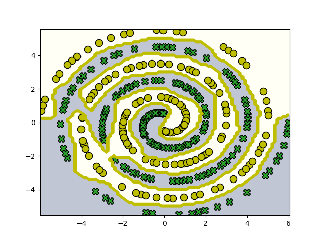

# 
这是gkc的第一次试炼

使用SGD优化器的最好参数：

MLP和MLQP:取--hidden_num 1024 --lr 0.002 --momentum 0.9进行比较
MLP最好的情况是在--hiddennum 2048，--lr 0.005
SOTA的最好情况是--hiddennum 64 --lr 0.01 --momentum 0.9

用Adam(效果更好)：
MLQP:
--model MLQP --hidden_num 256 --lr 0.001 
MLP:
--model MLP --hidden_num 2048 --lr 0.001
SOTA:hidden num 仍然用64足矣

运行结果示例：

